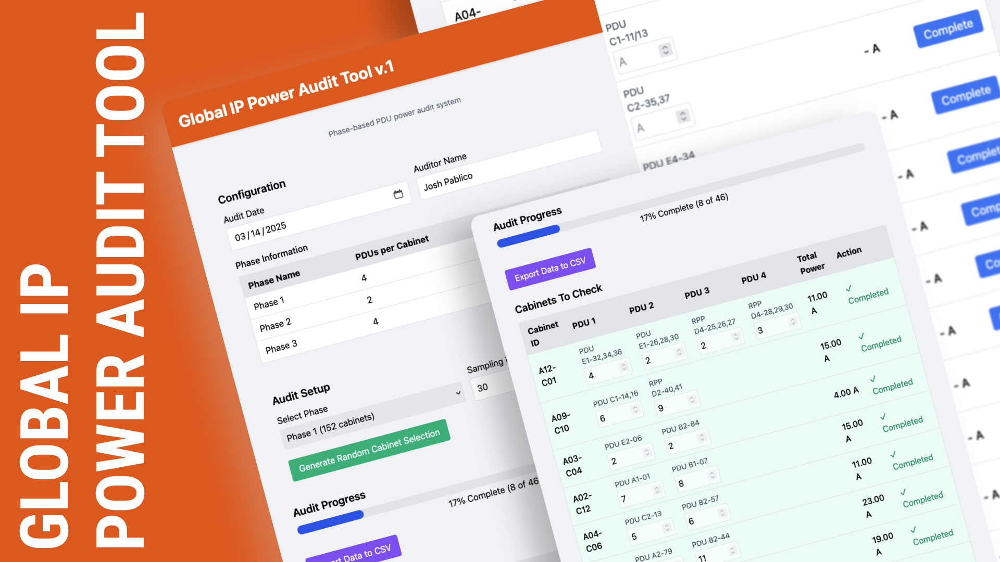

# Power Audit Tool

A lightweight web app designed to streamline cabinet power audits for data center technicians.

## Features

- Cabinet sampling by site phase groups
- Adjustable audit percentage
- PDU input with visual progress tracking
- CSV export for completed audits
- Responsive design for desktop, tablet, and mobile use

## Live Demo

View the working version at:  
https://jpablico.github.io/GIP-Power-Audit

## Future Plans

- Automatically upload CSVs to a server and merge into a master audit record
- Integrate audit history and timestamps into the internal NOC Dashboard
- Build a customer-facing portal for usage visibility and billing transparency
- Add time logging for audits to reflect hourly walk cycles (e.g., 2 AM, 6 AM)

## Tech Stack

- React
- Tailwind CSS
- Webpack
- PapaParse (CSV handling)

## Author

Created and maintained by [Josh Pablico](https://github.com/jpablico)
